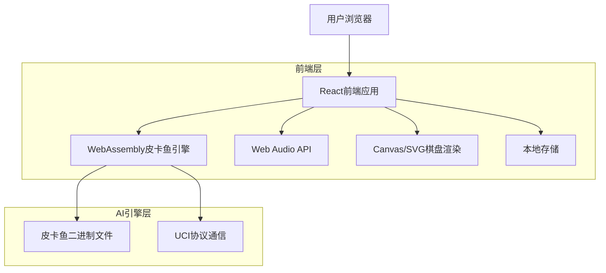
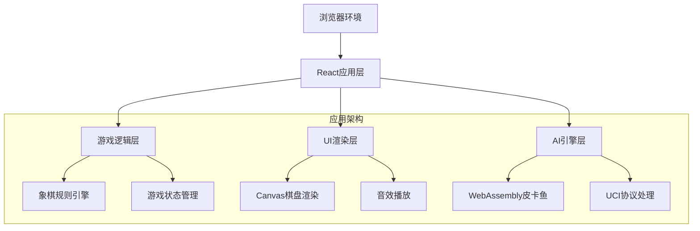
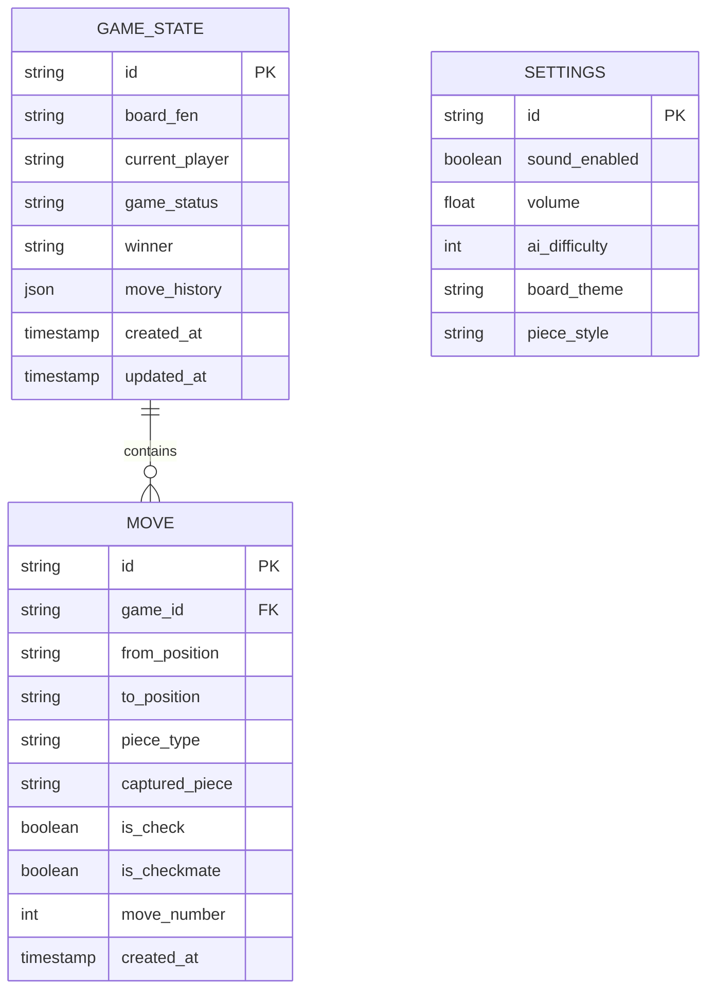

# 中国象棋网页版游戏技术架构文档

## 1. Architecture design



## 2. Technology Description

* **前端**: React\@18 + TypeScript + Vite + Canvas API + Web Audio API

* **AI引擎**: 皮卡鱼(Pikafish) WebAssembly版本

* **样式**: CSS3 + CSS Grid/Flexbox

* **音频**: Web Audio API + 预加载音效文件

* **存储**: localStorage (游戏设置、历史记录)

## 3. Route definitions

| Route     | Purpose         |
| --------- | --------------- |
| /         | 游戏主页面，包含棋盘和游戏控制 |
| /settings | 设置页面，音效和AI难度配置  |
| /help     | 帮助页面，游戏规则和操作说明  |

## 4. API definitions

### 4.1 皮卡鱼引擎接口

**初始化引擎**

```typescript
interface PikafishEngine {
  init(): Promise<void>;
  sendCommand(command: string): void;
  onMessage(callback: (message: string) => void): void;
}
```

**UCI命令接口**

```typescript
// 发送位置信息
interface PositionCommand {
  type: 'position';
  fen?: string; // FEN格式棋局
  moves?: string[]; // 移动历史
}

// 开始思考
interface GoCommand {
  type: 'go';
  depth?: number; // 搜索深度
  movetime?: number; // 思考时间(毫秒)
}

// 引擎响应
interface EngineResponse {
  type: 'bestmove' | 'info';
  move?: string; // 最佳移动
  score?: number; // 评分
  depth?: number; // 搜索深度
}
```

### 4.2 游戏状态接口

```typescript
// 棋子类型
type PieceType = 'k' | 'a' | 'b' | 'n' | 'r' | 'c' | 'p'; // 将/帅、士、象、马、车、炮、兵/卒
type PieceColor = 'red' | 'black';

interface Piece {
  type: PieceType;
  color: PieceColor;
  position: Position;
}

interface Position {
  x: number; // 0-8
  y: number; // 0-9
}

interface GameState {
  board: (Piece | null)[][]; // 10x9棋盘
  currentPlayer: PieceColor;
  gameStatus: 'playing' | 'checkmate' | 'stalemate' | 'draw';
  winner?: PieceColor;
  moveHistory: Move[];
  selectedPiece?: Position;
  legalMoves: Position[];
  lastMove?: Move;
}

interface Move {
  from: Position;
  to: Position;
  piece: Piece;
  capturedPiece?: Piece;
  isCheck: boolean;
  isCheckmate: boolean;
}
```

### 4.3 音效系统接口

```typescript
interface AudioSystem {
  loadSounds(): Promise<void>;
  playMove(): void;
  playCapture(): void;
  playCheck(): void;
  setVolume(volume: number): void;
  mute(muted: boolean): void;
}

type SoundType = 'move' | 'capture' | 'check';
```

## 5. Server architecture diagram

本项目为纯前端应用，无需服务器端架构。所有逻辑在浏览器中运行：



## 6. Data model

### 6.1 Data model definition



### 6.2 Data Definition Language

由于这是纯前端应用，数据存储使用localStorage，以下是数据结构定义：

**游戏状态存储**

```typescript
// localStorage key: 'xiangqi_game_state'
interface StoredGameState {
  board: string; // FEN格式
  currentPlayer: PieceColor;
  gameStatus: string;
  winner?: PieceColor;
  moveHistory: StoredMove[];
  timestamp: number;
}

interface StoredMove {
  from: string; // 如 "a1"
  to: string;   // 如 "b2"
  piece: string;
  captured?: string;
  isCheck: boolean;
  isCheckmate: boolean;
}
```

**用户设置存储**

```typescript
// localStorage key: 'xiangqi_settings'
interface StoredSettings {
  soundEnabled: boolean;
  volume: number; // 0-1
  aiDifficulty: number; // 1-10
  boardTheme: string;
  pieceStyle: string;
}
```

**默认设置数据**

```typescript
const DEFAULT_SETTINGS: StoredSettings = {
  soundEnabled: true,
  volume: 0.7,
  aiDifficulty: 5,
  boardTheme: 'classic',
  pieceStyle: 'traditional'
};
```

**初始棋盘FEN**

```typescript
const INITIAL_FEN = 'rnbakabnr/9/1c5c1/p1p1p1p1p/9/9/P1P1P1P1P/1C5C1/9/RNBAKABNR w - - 0 1';
```

